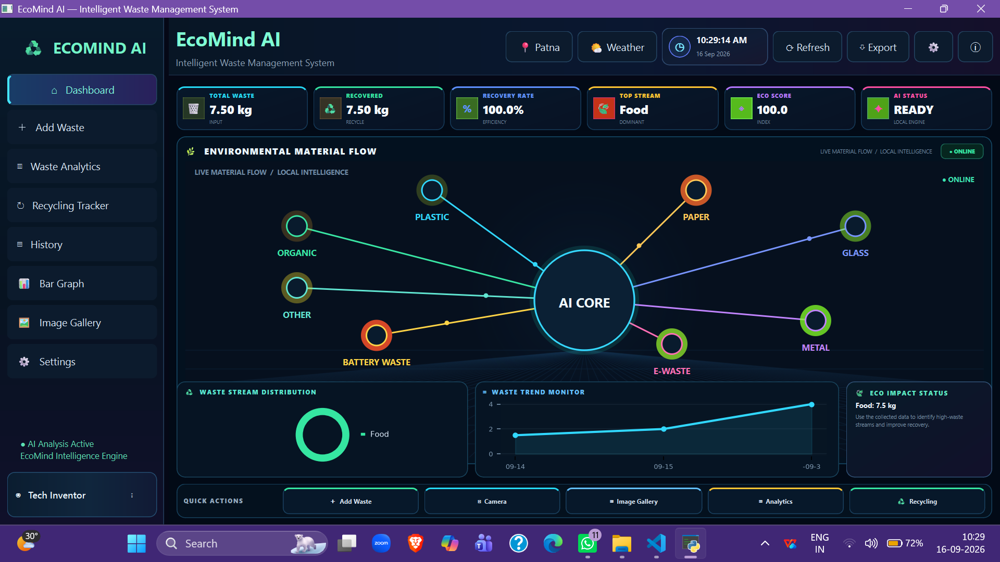
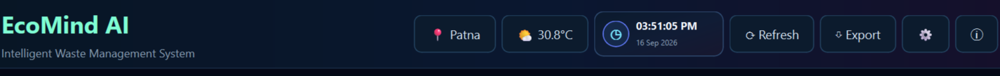
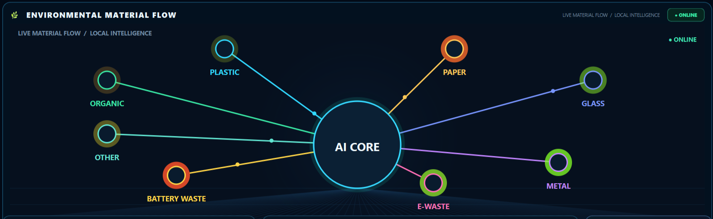
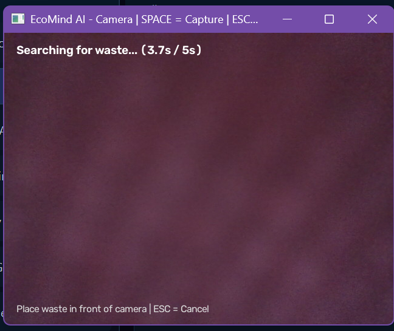
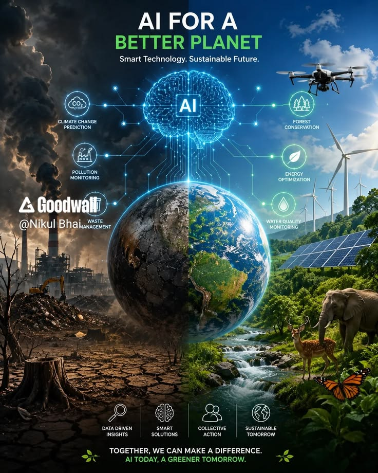
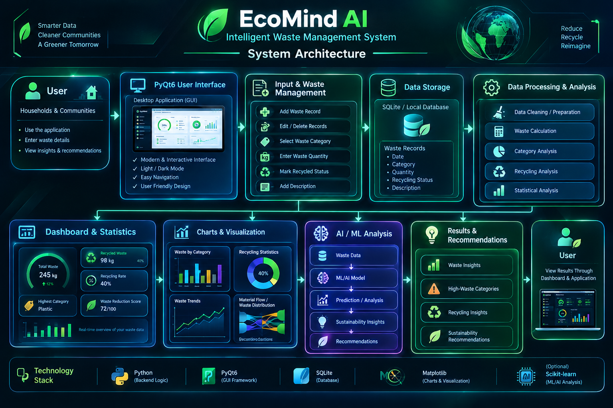
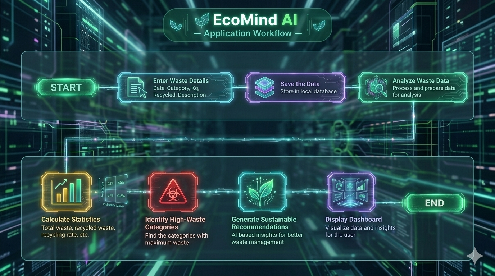

# 🌱 EcoMind AI

## Intelligent Waste Management System

<p align="center">
  
</p>

<p align="center">
  <b>Track Waste • Analyze Data • Improve Sustainability</b>
</p>

<p align="center">
  A smart desktop application designed to help households and communities understand their waste and improve recycling habits.
</p>

---

# 📌 Main Topic

## **Smart Waste Management & Sustainability**

Waste management is an important environmental challenge. People generate different types of waste every day, but it can be difficult to understand **where most waste is coming from, how much is being recycled, and where improvements can be made**.

**EcoMind AI** provides a digital platform to record waste data, analyze it, visualize patterns, and generate sustainability-focused recommendations.

---

# 🎯 Project Objective

EcoMind AI aims to:

* 📝 Record daily waste
* ♻️ Track recycled waste
* 📊 Analyze waste patterns
* 🔎 Identify high-waste categories
* 📈 Visualize waste statistics
* 💡 Provide sustainability recommendations
* 💾 Store waste records locally
* 🌍 Encourage better waste-management habits

---

# ✨ Key Features

### 📝 Waste Management

Users can record:

* Date
* Waste category
* Quantity in kilograms
* Recycling status
* Description
* Quick Access Toolbar
* Weather, Location and Time

Supported categories include:

**Food • Plastic • Paper • Glass • Metal • E-waste • Other**

---

### 📊 Dashboard

The dashboard provides a quick overview of waste information.

<p align="center">
  
</p>

It can display information such as:

* Total Waste
* Recycled Waste
* Recycling Rate
* Highest Waste Category
* Waste Reduction Score

---
### Quick Access Toolbar

The most frequent toolbar which can reduce the time of opening different menu.

<p align="centre">
   
</p>

### 📈 Charts & Visualization

Waste data can be represented through visual charts to make patterns easier to understand.

<p align="center">
  
</p>

Examples include:

* Waste by Category
* Recycling Statistics
* Waste Trends
* Material Flow / Distribution

---
### Weather, and Time

Allows the user to see the time and weather with defined location(Patna)

<p>
  
</p>
### ♻️ Material Flow

The Material Flow visualization shows how different waste materials are distributed within the recorded data.

<p align="center">
  
</p>

---

### Camera 

Allows the user to enter the images of waste

<p>
  
</p>

### 💡 Sustainability Recommendations

EcoMind AI can present useful sustainability-focused insights based on the recorded waste information.

<p align="center">
  
</p>

These insights can help users understand:

* High-waste categories
* Recycling opportunities
* Waste-reduction areas
* Sustainability actions

---

# ⚙️ How EcoMind AI Works

```text
👤 USER
   ↓
🖥️ PyQt6 User Interface
   ↓
📝 Enter Waste Details
   ↓
💾 Store Waste Records
   ↓
🗄️ SQLite Local Database
   ↓
⚙️ Data Processing & Analysis
   ↓
📊 Statistics + Charts
   ↓
💡 Insights & Recommendations
   ↓
👤 USER
```

---

# 🏗️ System Architecture

<p align="center">
  
</p>

The architecture connects the user interface, waste-management system, local database, data processing, visualization, analysis, and results.

---

# 🔄 Application Workflow

<p align="center">
  
</p>

The workflow represents the main process followed by the application from entering waste information to displaying the final results.

---

# 🛠️ Technology Stack

| Technology      | Purpose                              |
| --------------- | ------------------------------------ |
| 🐍 Python       | Application logic                    |
| 🖥️ PyQt6       | Desktop GUI                          |
| 🗄️ SQLite      | Local data storage                   |
| 📊 Pandas       | Data analysis, if used               |
| 📈 Matplotlib   | Data visualization, if used          |
| 🤖 Scikit-learn | ML analysis, if actually implemented |

---

# 📂 Project Structure

```text
EcoMind-AI/
│
├── National_Project_2.py
├── README.md
├── requirements.txt
│
└── documentation/
    │
    ├── Project_Documentation.md
    ├── Presentation.pptx
    │
    ├── diagrams/
    │   ├── workflow.png
    │   └── system_architecture.png
    │
    ├── screenshots/
    │   ├── dashboard.png
    │   ├── add_waste.png
    │   ├── waste_records.png
    │   ├── charts.png
    │   ├── material_flow.png
    │   └── recommendations.png
    │
    └── references/
        └── research_notes.md
```

---

# 🚀 Installation & Setup

### 1. Clone the repository

```bash
git clone YOUR_GITHUB_REPOSITORY_URL
```

### 2. Open the project folder

```bash
cd EcoMind-AI
```

### 3. Install dependencies

```bash
pip install -r requirements.txt
```

### 4. Run the application

```bash
python National_Project_2.py
```

---

# 💾 Data Storage

EcoMind AI uses local data storage for maintaining waste records.

Each record can contain:

```text
Date
Category
Quantity
Recycling Status
Description
```

This allows the application to analyze previously recorded waste data.

---

# 🌍 Environmental Impact

EcoMind AI focuses on making waste information **visible, understandable, and actionable**.

By understanding waste patterns and recycling behavior, users can identify areas where waste can potentially be reduced and recycling improved.

> **Measure your waste. Understand your habits. Build a cleaner future.**

---

# 🔮 Future Scope

Future versions could include:

* 🤖 Advanced Machine Learning models
* 📷 Image-based waste classification
* 🔮 Waste-generation prediction
* 📱 Mobile application
* ☁️ Cloud synchronization
* 👥 Community-level waste analysis
* 📊 Advanced sustainability analytics
* 🌐 Real-time environmental data

---

# 📚 Documentation

Detailed information about the project is available in the `documentation/` folder.

It contains:

📄 **Project Documentation**
🎞️ **Presentation**
🔄 **Workflow Diagram**
🏗️ **System Architecture**
📸 **Application Screenshots**
📚 **Research References**

---

# 👥 Project

### **EcoMind AI — Intelligent Waste Management System**

**Team:** Cyber Guardians

---

<p align="center">
  🌱 <b>EcoMind AI</b>
  <br>
  <i>Track Waste • Analyze Data • Improve Sustainability</i>
</p>
